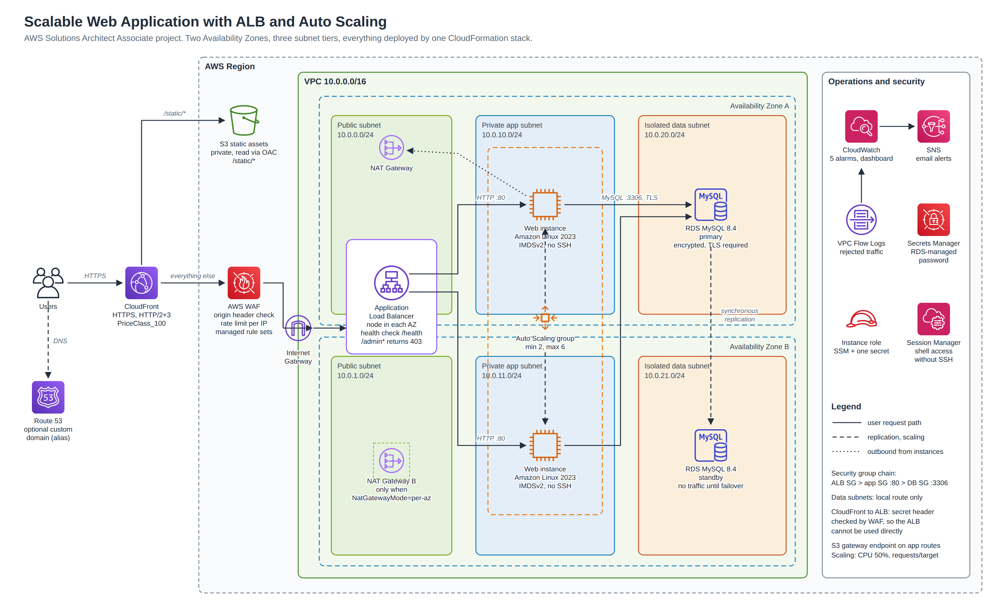

# Scalable Web Application with ALB and Auto Scaling

AWS Solutions Architect – Associate graduation project (Project 1).
Author: **Sherif Abdelaziz**

A highly available web application on Amazon EC2. Instances run in an Auto Scaling group behind an Application Load Balancer, spread across two Availability Zones, and share a Multi-AZ Amazon RDS for MySQL database. CloudFront is the single public entry point: it serves static files from a private S3 bucket and forwards everything else to the load balancer, which is protected by AWS WAF.

The whole environment is one CloudFormation template. It deploys with one command and deletes with one command.



The diagram is generated from code: [`architecture/diagram.py`](architecture/diagram.py). An SVG version is in [`architecture/architecture.svg`](architecture/architecture.svg).

---

## Contents

- [Requirements and how they are met](#requirements-and-how-they-are-met)
- [Architecture](#architecture)
- [Repository layout](#repository-layout)
- [Deploy](#deploy)
- [Test and demonstrate](#test-and-demonstrate)
- [Design decisions](#design-decisions)
- [Well-Architected mapping](#well-architected-mapping)
- [Cost](#cost)
- [Clean up](#clean-up)
- [What would change for production](#what-would-change-for-production)

---

## Requirements and how they are met

| Requirement | Implementation |
| --- | --- |
| Web application on EC2 | Python web app on Amazon Linux 2023, installed by launch template user data, run as a systemd service under a non-root user |
| Application Load Balancer | Internet-facing ALB in two public subnets, target group health check on `/health`, Layer 7 listener rule for `/admin*` |
| Auto Scaling | Auto Scaling group across two private subnets, min 2 / max 6, two target tracking policies (CPU 50%, ALB requests per target), ELB health checks so broken instances are replaced |
| High availability | Every tier spans two AZs: ALB nodes, EC2 instances, RDS primary and synchronous standby |
| Database | RDS MySQL 8.4 Multi-AZ in isolated subnets, storage encrypted, TLS required by parameter group, password managed by RDS in Secrets Manager |
| Static content and caching | Private S3 bucket read only by CloudFront through Origin Access Control; `/static/*` cached at the edge, dynamic pages not cached |
| Security | Three-tier VPC, security group chain, no SSH (Session Manager instead), IMDSv2, WAF with managed rules and rate limiting, ALB reachable only through CloudFront |
| Monitoring and alerting | CloudWatch dashboard, five alarms, SNS email notifications, VPC Flow Logs for rejected traffic |
| DNS | Optional Route 53 alias records for a custom domain (enabled by three stack parameters) |
| Infrastructure as code | Single CloudFormation template, linted in GitHub Actions on every push |
| Deliverables | Solution architecture diagram, this documentation, deployment and test scripts, test plan with evidence checklist |

---

## Architecture

### Request path

```
User
 └─ CloudFront (HTTPS, edge locations)
     ├─ /static/*  ─► S3 bucket (private, Origin Access Control)
     └─ everything else, with a secret x-origin-verify header
         └─ AWS WAF (on the ALB)
             └─ Application Load Balancer (public subnets, 2 AZs)
                 └─ Target group, health check GET /health
                     └─ EC2 instances in the Auto Scaling group (private subnets, 2 AZs)
                         └─ RDS MySQL Multi-AZ (isolated subnets, TLS)
```

### Network

| Tier | AZ A | AZ B | Internet route | What lives here |
| --- | --- | --- | --- | --- |
| Public | 10.0.0.0/24 | 10.0.1.0/24 | In and out through the Internet Gateway | ALB nodes, NAT Gateway |
| Private app | 10.0.10.0/24 | 10.0.11.0/24 | Outbound only, through NAT | Web instances |
| Isolated data | 10.0.20.0/24 | 10.0.21.0/24 | None, local route only | RDS primary and standby |

An S3 gateway endpoint is attached to the app route tables, so S3 traffic from the instances does not pass through the NAT Gateway.

### Security groups

```
internet ─► alb-sg :80 ─► app-sg :80 (source: alb-sg) ─► db-sg :3306 (source: app-sg)
```

Rules reference security groups rather than IP ranges, so they stay correct as instances are replaced. The database security group has no outbound rule.

### The application

[`app/app.py`](app/app.py) is a small Python web server. Every page view is written to the shared database, and the page shows:

- which instance and Availability Zone answered this request
- the last ten requests from all instances, with the zone each one came from
- the total requests per zone
- the database server hostname, MySQL version and TLS cipher in use

Refreshing the page shows the load balancer alternating between instances. During a database failover the page keeps working and shows a clear "database unreachable" message until the standby takes over, because `/health` never depends on the database: a database problem must not make the Auto Scaling group terminate healthy web servers.

---

## Repository layout

```
.
├── README.md
├── architecture/
│   ├── architecture.png        diagram (PNG, for slides)
│   ├── architecture.svg        diagram (SVG, renders on GitHub)
│   └── diagram.py              diagram as code
├── infrastructure/
│   └── main.yaml               CloudFormation template (the whole environment)
├── app/
│   ├── app.py                  web application (embedded into the template)
│   └── static/                 CSS and icon uploaded to S3, served by CloudFront
├── scripts/
│   ├── deploy.sh               create or update the stack, upload static files
│   ├── verify.sh               automated functional checks (PASS / FAIL)
│   ├── load-test.sh            CPU load through SSM, watch scale-out
│   ├── failover-test.sh        forced RDS failover with recovery timing
│   ├── destroy.sh              empty the bucket and delete the stack
│   ├── embed_app.py            copies app/app.py into the template user data
│   └── common.sh
├── docs/
│   ├── DEPLOYMENT.md           console and CLI deployment, troubleshooting
│   ├── TESTING.md              test plan, expected results, screenshot checklist
│   └── screenshots/
└── .github/workflows/validate.yml
```

---

## Deploy

Prerequisites: an AWS account, AWS CLI v2 configured, Bash, Python 3.

```bash
git clone https://github.com/Sherif-Omar95/a-test.git
cd a-test
export AWS_REGION=us-east-1
ALERT_EMAIL=you@example.com ./scripts/deploy.sh
```

The first deployment takes 20 to 30 minutes, mostly RDS Multi-AZ and CloudFront. When it finishes the script prints the stack outputs and the application URL. Confirm the SNS subscription email to receive alarms.

Optional parameters can be appended, for example:

```bash
./scripts/deploy.sh NatGatewayMode=per-az MaxSize=8
```

Deploying from the CloudFormation console instead is described in [docs/DEPLOYMENT.md](docs/DEPLOYMENT.md).

---

## Test and demonstrate

Full procedures, expected results and the screenshot checklist are in [docs/TESTING.md](docs/TESTING.md).

| Test | Command | Expected result |
| --- | --- | --- |
| Functional checks | `./scripts/verify.sh` | All checks PASS: load spread across instances, static file cached, ALB not reachable directly, `/admin` and SQL injection blocked, HTTP redirected, database reachable over TLS |
| Scale out and in | `./scripts/load-test.sh 12` | Desired capacity rises from 2 within about 5 minutes, then returns to 2 after the load stops |
| Self-healing | Terminate one instance in the console | Target becomes unhealthy, the group launches a replacement in the same AZ, the site stays up |
| Database failover | `./scripts/failover-test.sh` | RDS primary moves to the other AZ, the endpoint name does not change, the app recovers in about 1 to 2 minutes |

---

## Design decisions

**Two target tracking policies.** CPU at 50% covers compute-heavy load; requests per target covers traffic spikes that are not CPU-bound. Auto Scaling follows whichever policy asks for more capacity, and only scales in when both agree.

**ELB health checks on the Auto Scaling group.** The default EC2 status check only notices a failed instance, not a failed application. With the ELB health check type, an instance whose web process stops is replaced.

**Health check independent of the database.** `/health` returns 200 as long as the web process is running. If it checked the database, a database failover would mark every instance unhealthy and the group would start replacing healthy servers.

**CloudFront as the only entry point.** CloudFront adds a secret header to every request it sends to the ALB, and the first WAF rule blocks any request without it. Requests sent straight to the ALB DNS name return 403. The rate limit uses the client address from `X-Forwarded-For`, because behind CloudFront every request arrives from a CloudFront address.

**Split caching.** `/static/*` uses the managed CachingOptimized policy; everything else uses CachingDisabled. Caching the dynamic page would show every visitor the same instance and hide the load balancing.

**No SSH anywhere.** Instances have no key pair and no port 22. Administrative access is through Systems Manager Session Manager, authorised by IAM and logged. The load test also runs through SSM Run Command.

**Credentials.** RDS creates and stores the master password in Secrets Manager (`ManageMasterUserPassword`). The instance role can read that one secret ARN and nothing else. The app re-reads the secret every five minutes so a rotated password is picked up.

**Isolated data tier.** The data subnets have a route table with only the local route and the database security group has no outbound rules, so even a compromised database has no path out.

**MySQL 8.4.** MySQL 8.0 has reached the end of RDS standard support, and running it adds RDS Extended Support charges per vCPU-hour on top of the instance price. The template defaults to 8.4.

**One NAT Gateway by default.** Saves about 33 USD a month. The trade-off is that if AZ A fails, instances in AZ B lose outbound internet (they still serve traffic). `NatGatewayMode=per-az` removes that dependency.

**Rolling updates with signals.** Each instance calls `cfn-signal` only after its local health check passes. A broken launch template change rolls back instead of replacing the fleet with broken instances.

---

## Well-Architected mapping

| Pillar | How this design addresses it |
| --- | --- |
| Operational excellence | Everything in code, CI validation, CloudWatch dashboard, alarms to SNS, Session Manager instead of SSH, scripted tests |
| Security | Three subnet tiers, security group chain, WAF, origin lockdown, IMDSv2, encryption at rest and in transit to the database, least-privilege role, flow logs |
| Reliability | Multi-AZ for every tier, ELB health checks with automatic replacement, RDS automatic failover, rolling updates gated by health signals |
| Performance efficiency | Target tracking on two metrics, CloudFront edge caching for static content, HTTP/2 and HTTP/3, gp3 volumes |
| Cost optimization | Scale in when idle, single NAT option, S3 gateway endpoint, PriceClass_100, burstable instances, MySQL version without Extended Support charges |
| Sustainability | Capacity follows demand instead of running for peak all the time; managed services share infrastructure |

---

## Cost

Approximate on-demand prices in us-east-1 with default parameters, outside the free tier. Check the [AWS Pricing Calculator](https://calculator.aws/) for current figures.

| Component | Approx. monthly |
| --- | --- |
| RDS db.t3.micro Multi-AZ + 20 GB gp3 | 30 USD |
| NAT Gateway (1) + data processing | 35 USD |
| Application Load Balancer + LCUs | 22 USD |
| 2 × EC2 t3.micro + EBS + detailed monitoring | 21 USD |
| WAF (web ACL + 5 rules) | 10 USD |
| Public IPv4 addresses (NAT, ALB nodes) | 11 USD |
| CloudWatch alarms and dashboard, Secrets Manager, logs | 5 USD |
| CloudFront, S3 | under 1 USD (free tier) |
| **Total** | **about 135 USD a month, roughly 0.19 USD an hour** |

Deploying, testing, capturing screenshots and destroying in one afternoon costs one or two dollars. Create an AWS Budgets alert before deploying.

---

## Clean up

```bash
./scripts/destroy.sh
```

This empties the static bucket and deletes the stack, including the database. RDS is configured with `DeletionPolicy: Delete` and one day of backups because this is a demo.

---

## What would change for production

| Setting | This project | Production |
| --- | --- | --- |
| HTTPS to the ALB | HTTP from CloudFront to ALB | ACM certificate on the ALB, HTTPS-only origin |
| NAT Gateways | One | One per AZ |
| RDS deletion | Delete with the stack, 1-day backups | Deletion protection, final snapshot, 7–35 day backups |
| Encryption keys | AWS managed keys | Customer managed KMS keys |
| Origin secret | Derived from the stack ID | Random value in Secrets Manager, rotated |
| Logs | 14-day flow log retention, no ALB access logs | Longer retention, ALB and CloudFront access logs to S3 |
| Capacity | On-demand | Savings Plan for the baseline, on-demand for the scaled portion |
| Database reads | Primary only | Read replicas or Aurora if reads grow |
